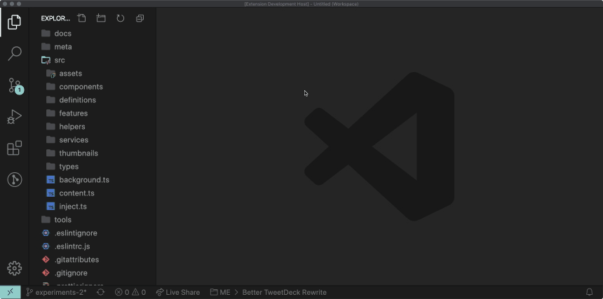

# Auto Fold Imports

Like the name implies, this extension automatically folds the ES6 imports of JavaScript and TypeScript files.

## Features

- Automatically folds ES6 imports in JavaScript and TypeScript files
- Adds commands to fold and unfold imports of the current file, respectively
  - `auto-fold-imports.fold`
  - `auto-fold-imports.unfold`

## Extension Settings

This extension contributes the following settings:

- `auto-fold-imports.auto`: Controls the automatic folding of imports.
- `auto-fold-imports.debug`: Whether to print debug statements or not.
- `auto-fold-imports.minimumBlockSize`: How big an imports block needs to be before it's auto folded.
- `auto-fold-imports.extraLanguages`: Extra languages in which to auto folds.

## Release Notes
